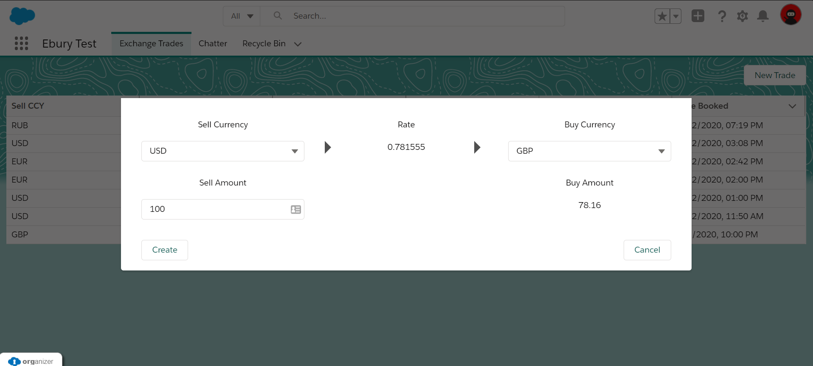
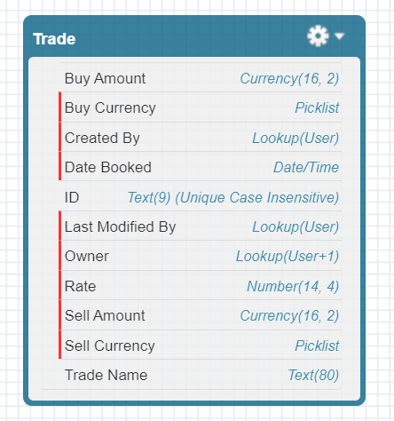
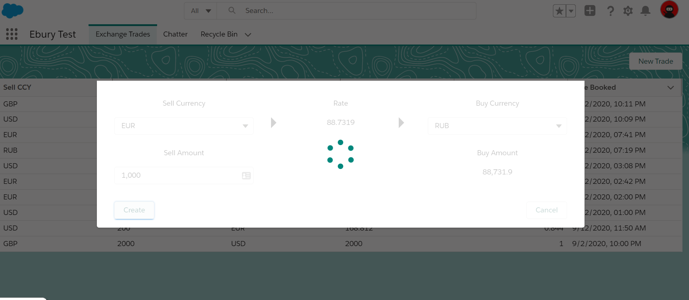
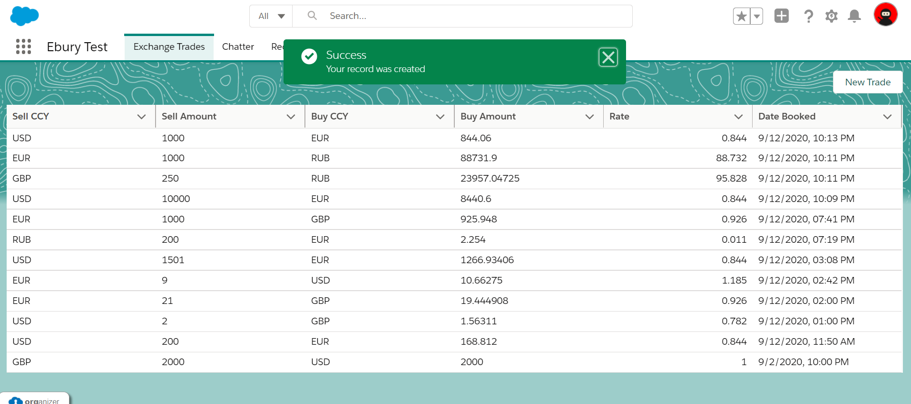
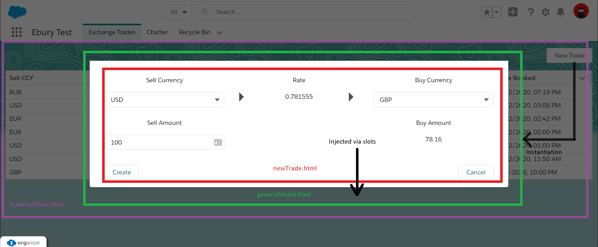
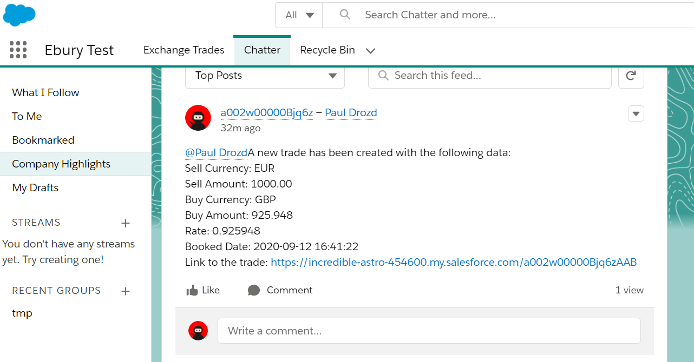
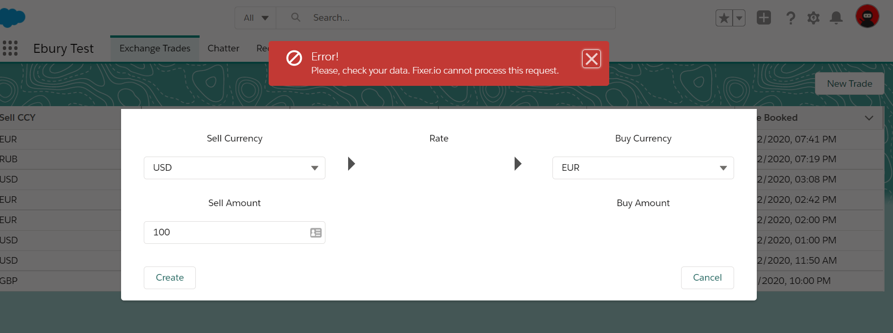
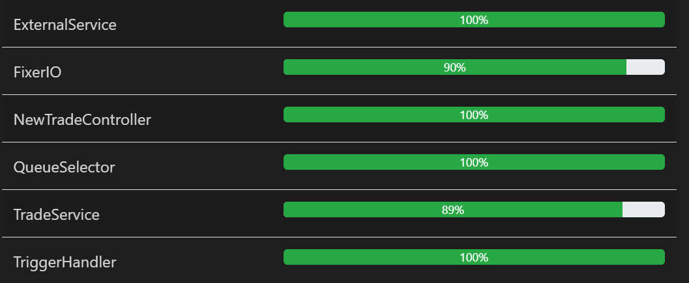

# Ebury technical test

> The application constist of two main views. The list view lists the trades existing in the Salesforce database. The default sorting order is based on Date Booked. The second "New Trade" view creates new Trade records. It uses Fixer.io to pull relevant exchange rates for a specific Sell Amount - Sell Currency - Buy Currency combination. That's why the application requires Fixer.io account.

**REQ1**

- Trade__c SObject represents Exchange Trade record in the Salesforce database.

- ID__c is unique auto-generated field. The application uses both LWC and Apex Trigger to verify it is populated on each new record.
- Sell Currency and Buy Currency are both picklist fields which reference Global Value Set "Currency"
- The application includes SFDX-formatted Trade__c and Trade Layout metadata.
- Spinner is displayed after user clicks "Create" button

- Toast success or error messages are displayed as well.

**REQ2**

- It was decided to use Lightning Web Components for the view. 
- The table view is reactive: when a new Trade record is created, the table is automatically refreshed.
- The "New Trade" Lightning Web Component uses generic modal LWC container, so that the modal rendering and "New Trade" functionalities are decoupled and don't depend on each other.

- LWC has frontend-side validation logic.

**REQ3**

- Queue selector layer is used to fetch Users which are included into "Trade reviewers" queue.
- The solution uses Apex ConnectAPI to create the Chatter post and share it with Users from "Trade reviewers" queue.
- The solution is bulkified.
- Simple TriggerHandler is used as a trigger framework.
 

 **REQ4**

 - The application uses Fixer.io to convert Sales Amount to Buy Amount.
 - Generic Apex layer is added to handle different integrations to third-party systems.
 - URL and token are stored in a special Custom Metadata Type (named credentials doesn't support this functionality yet).

 **REQ5**

SFDX deployment guide

 Prerequisites:
 - Access to Salesforce DevHub org. 
 - Access to Fixer.io account.
 Both items are provided in a private email. Current repository doesn't contain secrets or any private information.

 Steps:
1. Authorize your DevHub: `sfdx force:auth:web:login --setdefaultdevhubusername --setalias paulEburyDevHub`
2. Create new scratch org: `sfdx force:org:create -f project-scratch-def.json`
3. Push the source code: `sfdx force:source:deploy -p force-app`
4. Create "Trade reviewers" queue on the org.
5. Create new Fixer.io record in "External Services" custom metadata type. It should include your API access token.

**Error handling**

- Possible errors are handled both in LWC and in Apex code.
 

**Code coverage**

- All apex classes are covered with negative and positive unit tests.
 